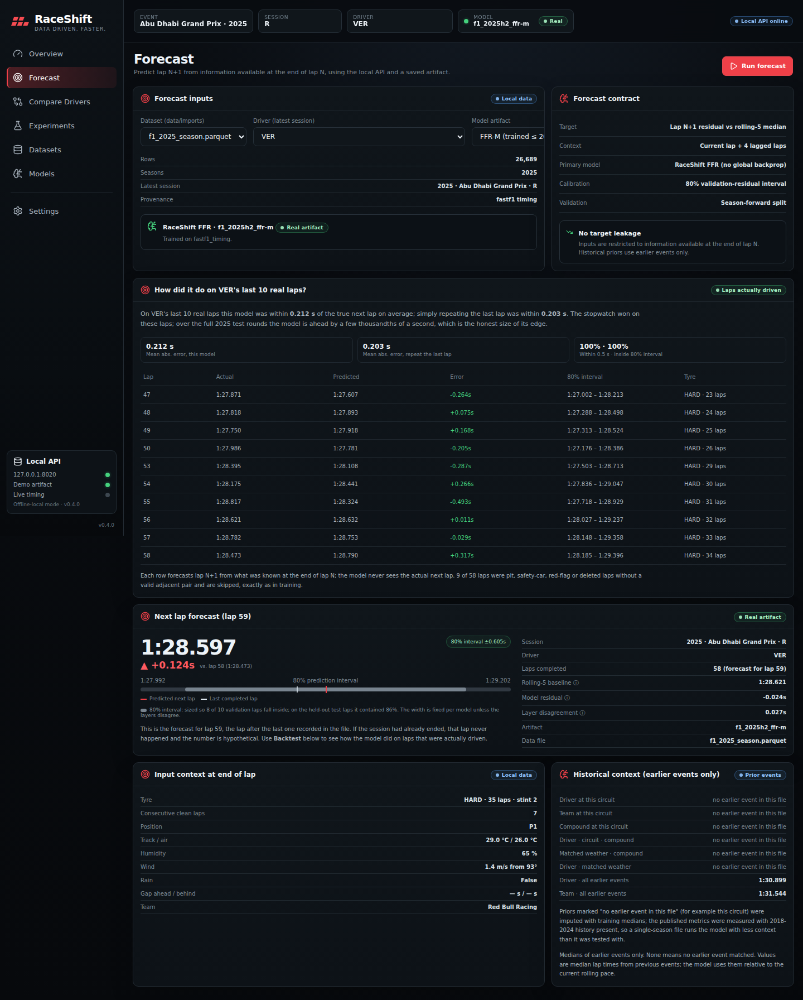
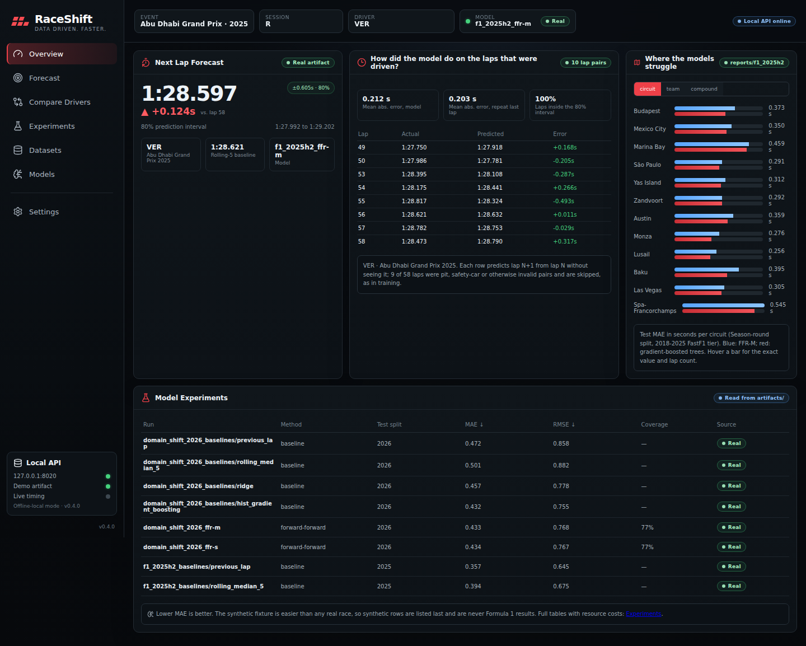
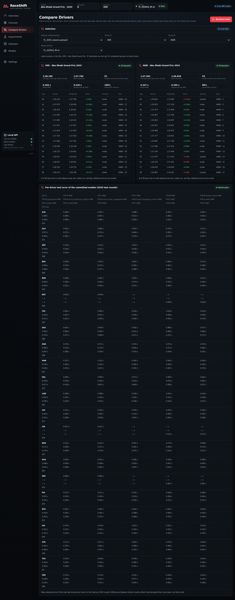
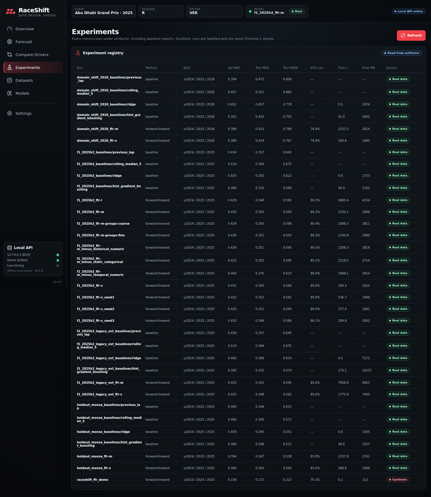
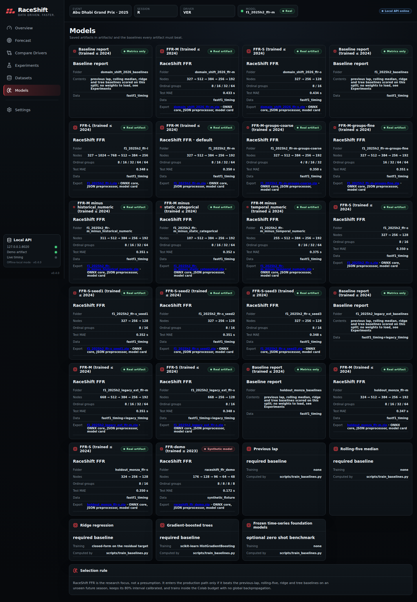
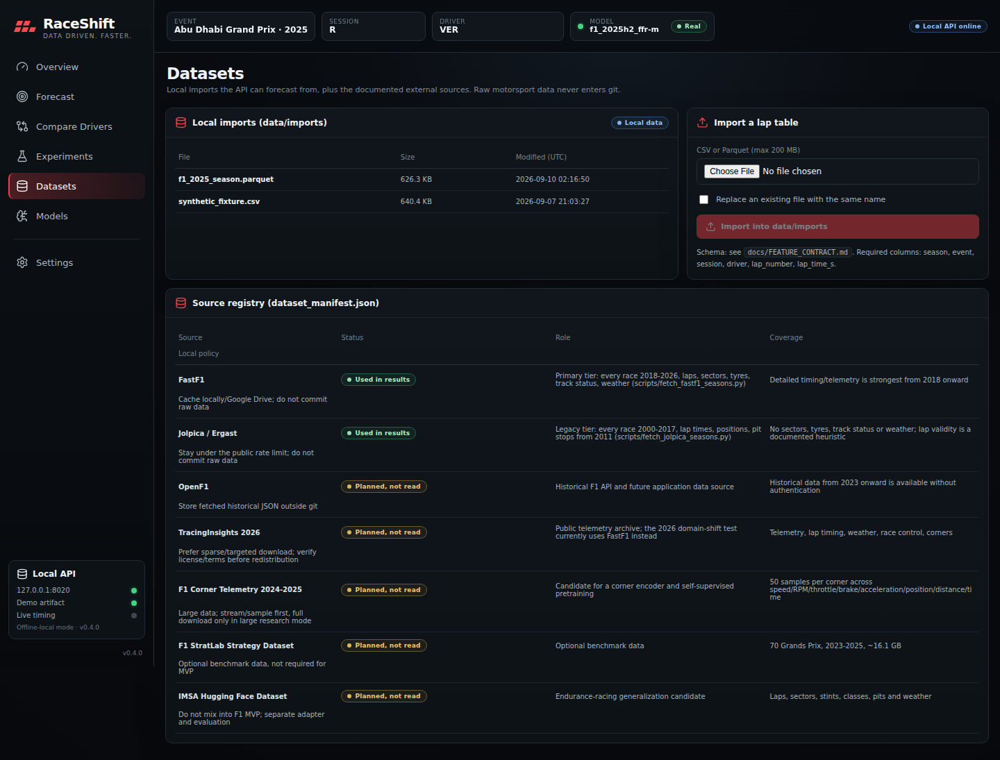
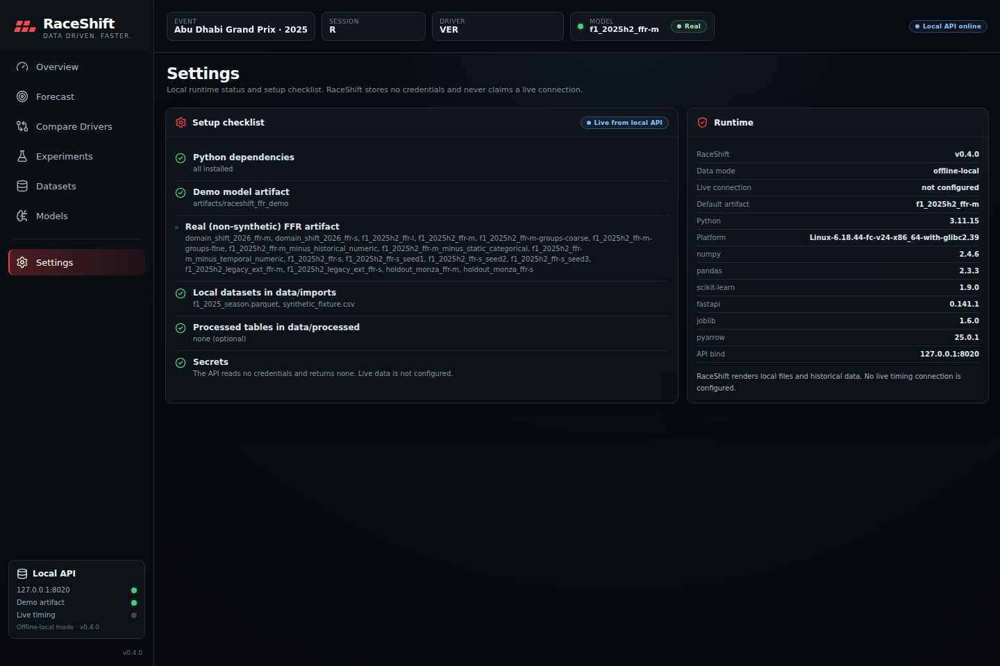

# RaceShift

**Forward-only motorsport pace forecasting.** RaceShift predicts a Formula 1 driver's next lap
from what is known at the end of the current lap, and uses that task to test a Forward-Forward-
style model: layers trained one at a time on a local objective, with no gradient flowing
between them (see the protocol notes for what that does and does not share with Hinton's
Forward-Forward). Inputs:

- driver, constructor and circuit identity
- tyre compound, age and stint
- race context: position, gaps, consecutive clean laps
- weather: track and air temperature, humidity, pressure, rain, wind as sine/cosine
- recent pace: rolling medians, sector shares, four lagged laps (scoped to clean racing laps)
- historical matched conditions from earlier events only

**Research question**

> Can Forward-Forward regression, trained layer by layer with no global backpropagation,
> approach conventional forecasting accuracy while reducing training-memory requirements?

RaceShift does not assume the answer. Every run reports accuracy, calibration, training time,
peak memory, inference latency and artifact size next to naive, linear and tree baselines.



<details>
<summary><strong>More screenshots</strong> (real 2025 data, real FFR-M model, captured from the shipped setup)</summary>

| Overview: forecast, backtest, where the models struggle | Compare Drivers: VER vs NOR, pace and model error side by side |
| --- | --- |
|  |  |

| Experiments: every run under artifacts/ | Models: artifacts, baselines and exports |
| --- | --- |
|  |  |

| Datasets: local imports and source registry | Settings: setup checklist and runtime |
| --- | --- |
|  |  |

</details>

## Run it

Python 3.11+ and Node.js 20+.

```bash
python -m venv .venv && source .venv/bin/activate      # Windows: .venv\Scripts\Activate.ps1
pip install -e ".[local]"
npm install
npm run dev
```

UI at <http://127.0.0.1:5173>, API at <http://127.0.0.1:8000/api/health>. Open **Forecast** and
press **Run forecast**: the repository ships the whole 2025 season of FastF1 race timing
(`data/imports/f1_2025_season.parquet`, 640 KB) and the real-data FFR-M model. The first run
takes about 10 s to build features for the season (repeat runs on the same file are instant)
and shows two things for the 2025 Abu Dhabi race winner: how the model did on their last ten
laps that were actually driven (predicted vs actual, next to the "repeat the last lap"
stopwatch baseline), and a forecast for the lap after the last one in the file, which is
hypothetical when the race has ended. Nothing needs to be trained or downloaded. Also
included: `f1_2026_races.parquet`, the 13 races run so far in 2026, which no committed model
has trained on (choose it in the dataset selector to backtest a race the model has never seen),
and a synthetic fixture with a small demo model trained on it, both badged *Synthetic*
wherever they appear. Drivers are identified by their FIA three-letter codes.

```bash
npm run build       # TypeScript check + Vite build
API_PORT=8010 WEB_PORT=5180 npm run dev                # if 8000 or 5173 is taken
python scripts/fetch_fastf1.py --year 2025 --event "Abu Dhabi" --session R \
    --output data/imports/abu_dhabi_2025.parquet       # one more race in about 15 s; the UI lists it
npm run demo:data && npm run demo:model                # regenerate the synthetic fixture and demo model (untracked output)
```

A step-by-step walkthrough with expected output is in `docs/LOCAL_SETUP.md`. There is no
live-timing connection; RaceShift reads local files only. If a port is taken, the API prints
two ports that are free at that moment and the exact command to use them. `npm install`
reports two moderate advisories in react-router's server-side rendering paths, which this
client-only app does not use; the dependency audit in CI fails only on high severity.

**How to read the numbers.** This is regression, not classification, so there is no
"accuracy" percentage. MAE is the average distance in seconds between the predicted and the
true next lap, and lower is better. Read the results as: the model is typically within about a
third of a second of the real next lap on laps of about 90 s, predicts 8 in 10 laps within
half a second and 19 in 20 within one second, and its "80% interval" contains the true lap
about 86% of the time on the 2025 test rounds (it is a single width per model, set on the
validation rounds, so it is slightly too wide in 2025 and too narrow after the 2026 rule
change). All of that is measured on laps whose *next* lap was also a clean racing lap: pit
laps, safety cars and red flags are excluded from the score, which a live forecaster could
not know in advance. Every table also reports the two zero-parameter baselines (repeat the
last lap, take the five-lap median): a model that does not clearly beat them has not learned
anything a fan could not do with a stopwatch. FFR-S, FFR-M and FFR-L are the same model at
three widths (256→128, 512→384→256→192 and 1024→768→512→384 hidden units; `configs/`).

## Results

<!-- RESULTS:BEGIN -->
**Season-round split, 2018-2025 FastF1 tier** — train ≤ 2024 · validation 2025 rounds ≤ 12 · test 2025 rounds > 12. Rows: train 119182, validation 9751, test 10519. Data: fastf1_timing.

| Model | Test MAE (s) | Test RMSE (s) | p90 (s) | Laps within 0.5 s | 80% coverage | Train time (s) | Peak RSS (MB) | Traced train peak (MB) | Artifact (MB) |
| --- | ---: | ---: | ---: | ---: | ---: | ---: | ---: | ---: | ---: |
| previous_lap | 0.336 | 0.551 | 0.768 | 81.8% | — | — | — | — | — |
| rolling_median_5 | 0.366 | 0.576 | 0.825 | 78.6% | — | — | — | — | — |
| ridge | 0.357 | 0.531 | 0.744 | 78.4% | — | 0.4 | 1859 | 340 | — |
| **hist_gradient_boosting** | 0.303 | 0.493 | 0.656 | 84.7% | — | 42.6 | 2214 | 439 | — |
| FFR-M | 0.331 | 0.505 | 0.693 | 82.1% | 0.865 | 2572.7 | 2654 | 1325 | 3.31 |
| FFR-S | 0.328 | 0.501 | 0.694 | 82.2% | 0.859 | 494.6 | 1933 | 593 | 1.82 |
| FFR-L | 0.327 | 0.505 | 0.691 | 82.4% | 0.862 | 11276.4 | 3928 | 2591 | 8.18 |
| FFR-M-groups-coarse | 0.332 | 0.510 | 0.704 | 81.5% | 0.852 | 2415.2 | 2670 | 1321 | 3.27 |
| FFR-M-groups-fine | 0.332 | 0.505 | 0.692 | 81.7% | 0.860 | 2603.6 | 2670 | 1332 | 3.31 |
| FFR-M minus historical_numeric | 0.330 | 0.504 | 0.698 | 81.9% | 0.869 | 2540.1 | 2665 | 1325 | 3.27 |
| FFR-M minus temporal_numeric | 0.351 | 0.534 | 0.747 | 79.7% | 0.855 | 2331.8 | 2660 | 1324 | 3.16 |
| FFR-M minus static_categorical | 0.329 | 0.504 | 0.699 | 82.1% | 0.851 | 2685.5 | 2574 | 1324 | 2.89 |

Full table with validation metrics, interval widths and latency: `reports/f1_2025h2/summary.md`. Error by circuit, constructor, compound, tyre age, conditions, race phase and position: `reports/f1_2025h2/breakdowns.md`.

**Circuit holdout (Monza)** — every season of **Italian Grand Prix** held out; train ≤ 2024, validation 2025. Rows: train 114924, validation 19463, test 5857. Data: fastf1_timing.

| Model | Test MAE (s) | Test RMSE (s) | p90 (s) | Laps within 0.5 s | 80% coverage | Train time (s) | Peak RSS (MB) | Traced train peak (MB) | Artifact (MB) |
| --- | ---: | ---: | ---: | ---: | ---: | ---: | ---: | ---: | ---: |
| previous_lap | 0.332 | 0.543 | 0.781 | 81.7% | — | — | — | — | — |
| rolling_median_5 | 0.341 | 0.524 | 0.762 | 79.7% | — | — | — | — | — |
| ridge | 0.321 | 0.493 | 0.685 | 82.5% | — | 0.6 | 1812 | 352 | — |
| **hist_gradient_boosting** | 0.289 | 0.465 | 0.638 | 85.2% | — | 34.3 | 2190 | 452 | — |
| FFR-M | 0.335 | 0.487 | 0.669 | 81.3% | 0.836 | 2473.4 | 2620 | 1278 | 2.69 |
| FFR-S | 0.333 | 0.485 | 0.671 | 81.3% | 0.826 | 455.6 | 1913 | 572 | 1.20 |

Full table with validation metrics, interval widths and latency: `reports/holdout_monza/summary.md`.

**2026 domain shift, no retraining** — train ≤ 2024 · validation 2025 · test 2026. Rows: train 119182, validation 20270, test 10778. Data: fastf1_timing.

| Model | Test MAE (s) | Test RMSE (s) | p90 (s) | Laps within 0.5 s | 80% coverage | Train time (s) | Peak RSS (MB) | Traced train peak (MB) | Artifact (MB) |
| --- | ---: | ---: | ---: | ---: | ---: | ---: | ---: | ---: | ---: |
| previous_lap | 0.453 | 0.751 | 1.104 | 73.3% | — | — | — | — | — |
| rolling_median_5 | 0.475 | 0.751 | 1.133 | 69.9% | — | — | — | — | — |
| ridge | 0.426 | 0.680 | 0.973 | 73.8% | — | 2.3 | 1906 | 368 | — |
| **hist_gradient_boosting** | 0.409 | 0.667 | 0.938 | 75.6% | — | 36.3 | 2293 | 471 | — |
| FFR-M | 0.413 | 0.665 | 0.935 | 75.2% | 0.767 | 2572.4 | 2693 | 1325 | 3.31 |
| FFR-S | 0.412 | 0.662 | 0.935 | 75.5% | 0.767 | 494.8 | 1966 | 593 | 1.83 |

Full table with validation metrics, interval widths and latency: `reports/domain_shift_2026/summary.md`.
<!-- RESULTS:END -->

Every number above is reproducible from `scripts/run_experiments.py` on FastF1 data. Synthetic
fixture numbers are never reported as Formula 1 results.

**Protocol notes that matter when reading the tables.**

- Every row is a single run with seed 42. Three extra seeds of FFR-S on the season split give a
  test MAE of 0.350 ± 0.002 s (`reports/f1_2025h2/seeds.md`), so differences of a few
  thousandths of a second between FFR variants (depth, group ladders, ablations that "change
  nothing") are noise, not effects. Only the temporal-features ablation (+0.025 s) clears
  that bar.

**What the numbers say so far** (2018-2024 training, 128k clean laps; test = 2025 rounds 13-24; lap-validity rules v3):

- Gradient-boosted trees are the most accurate model and train in under a minute. Forward-Forward
  regression does not beat them on this task (0.316 s vs 0.348-0.350 s test MAE).
- FFR beats the linear and rolling-median baselines and edges the naive previous-lap baseline by
  0.007-0.009 s. That gap is real but small: repeating the last lap already gets 80.6% of laps
  within half a second, FFR-M 80.6%, the tree 83.8%.
- Depth does not pay: FFR-S, FFR-M and FFR-L land at 0.350, 0.350 and 0.348 s for 6.5, 37 and
  166 minutes of training. The differences are inside seed noise (see the protocol notes).
- Interval calibration works: the 80% intervals cover 85-86% of test laps.
- Memory, measured around the fit only for every model: the tree trains in 56 s within 467 MB of
  traced allocations; FFR-S needs 636 MB and 6.5 minutes, FFR-M 1,421 MB and 37 minutes, FFR-L
  2,778 MB and 166 minutes. The training-memory advantage argued for Forward-Forward does not
  appear in this NumPy implementation at any size: the layers are trained one at a time, but each
  layer's full-batch activations are materialised before the next layer is trained, and that
  dominates. An earlier version of this table charged the baselines for preprocessing as well,
  which made FFR-S look lighter than the tree; that measurement has been corrected.
- Ablations: removing the temporal pace features costs 0.025 s MAE; removing historical priors
  or driver/team/circuit identity changes nothing measurable. Recent pace carries the signal.
- Group-ladder variants (4/8/16/32, 8/16/32/64, 16/32/64/64) are indistinguishable.
- **Memorisation check.** Every model's error on its own training laps (FFR about 0.46 s, tree
  0.41 s) is higher than on validation (0.43 s) and test (0.35 s) because the training seasons
  contain more disrupted laps; the 2025 test rounds are the cleanest laps in the data. A negative
  train-to-test gap rules out gross overfitting but does not by itself prove generalisation;
  the circuit holdout and the 2026 shift below are the real tests. Train, validation and test
  metrics are recorded for every run, and `reports/f1_2025h2/generalization.md` has the
  per-season table.
- **Unseen circuit (every Italian Grand Prix held out).** With the red-flag restart lap excluded,
  Monza is no harder than the season split: trees 0.298 s, ridge 0.345 s, previous lap 0.346 s,
  FFR-M 0.347 s, FFR-S 0.350 s, RMSE 0.51-0.62 s for every model. FFR no longer loses more than
  the tree on an unseen circuit; it simply ties the naive baseline there. Under the version 1
  rules the same experiment reported RMSE of 2.5-3.1 s and FFR-M at 0.558 s, all from the
  handful of restart laps.
- **2026 domain shift (new regulations, model trained through 2024, never retrained).** Every
  model degrades by about 0.08 s MAE: trees 0.432 s, FFR-M 0.433 s, FFR-S 0.434 s, ridge
  0.457 s, previous lap 0.472 s. FFR-M has the best p90 (0.96 s) and degrades no worse than the
  tree, but its 80% intervals, calibrated on 2025, cover only 77% of 2026 laps: the shift is
  visible in calibration before it is visible in MAE.
- **Independent blind test on the 2026 races through the shipped product (see below).** A
  tester who was given only the repository link fetched the 13 races run so far in 2026 with
  the repo's own loader and scored the committed FFR-M through the API's inference path:
  0.435 s MAE, RMSE 0.78 s, 80% interval coverage 80%, previous lap 0.472 s. That matches the
  experiment-script numbers above only after a bug the test exposed was fixed: the API had
  dropped untimed laps before applying the lap-validity rules, which let red-flag restart laps
  through and doubled the RMSE. The report, with every edge case tried, is in
  `reports/blind_2026/REPORT.md`.
- **Training extended to 2000 with the legacy tier (429,546 laps, same 2025 test rows).** The
  extra eighteen seasons of lap-time-only history help the linear model most (ridge 0.392 →
  0.368 s) and the others barely: trees 0.316 → 0.315 s, FFR-S 0.350 → 0.348 s, FFR-M 0.350 →
  0.351 s. Training cost grows with the data: the tree needs 5 minutes and 5.7 GB traced,
  FFR-S 30 minutes and 2.6 GB, FFR-M over two hours. Under the version 1 rules the same
  extension had looked worth 0.005-0.015 s for every model; most of that was the restart laps.

### Blind test on unseen 2026 races

Published numbers are only as good as the product that serves them, so an independent tester
was given nothing but the repository link and asked to feed the product data it had never
seen and check its outcomes against reality. The tester fetched every 2026 race run so far
(13 rounds, Australia to Monza, 15,149 laps, new regulations, two new teams and four new
drivers) with `scripts/fetch_fastf1.py`, scored the committed FFR-M through the API against
the real next laps, simulated live use at laps 5 to 50, and tried malformed uploads, path
traversal, leakage probes, concurrency and unseen categories. The 2026 table now ships as
`data/imports/f1_2026_races.parquet`, so the same check runs from the Forecast page.

| Unseen 2026 races, committed FFR-M | Before the fixes | After the fixes |
| --- | ---: | ---: |
| Scored lap pairs | 11,457 | 11,445 (same rows as the experiment scripts) |
| FFR-M MAE / RMSE | 0.479 s / 1.48 s | 0.435 s / 0.78 s |
| Previous-lap MAE / RMSE | 0.505 s / 1.48 s | 0.472 s / 0.86 s |
| Largest single error | 57.1 s (restart lap) | 19.1 s (first lap after a safety car) |
| 80% interval coverage | 79.6% | 79.8% |
| Tsunoda, Monza 2026, whole-race backtest RMSE | 7.8 s | 0.23 s |
| Five parallel first requests on a new file | 60 s each | 6.4 s each |

What the test established: no leakage (truncating the file, editing later laps, editing other
drivers' laps or shuffling rows changes a forecast by exactly 0.00 s); the model's edge over the
stopwatch on unseen races is small (about 0.03 s per lap, ahead on 52% of laps) and it loses on
fresh tyres, in the wet, at lap 5 and at Suzuka and Monza; unseen drivers cost nothing, unseen
team Cadillac is at 0.95 s with no edge; the 80% interval is in practice a fixed ±0.6 s band
because layer disagreement never exceeds its floor; and in live use 7% of "next laps" are pit or
safety-car laps where every model is off by about 10 s. Fixed after the test: the validity
mismatch above, a cold-cache stampede (feature table now built once under a lock and shared
across artifacts), two unhandled 500s (a filename with a null byte, a text `season` column),
the Forecast page now backtests a race even when the driver's final lap cannot be forecast
from (deleted or pit lap), qualifying and practice sessions carry a warning, and the fetch
script reports an unrun or unknown event instead of a traceback. The two lap-rule holes it
found, yellow-flag laps counted as clean (309 rows, 1.9 s error) and the first lap after a
safety car entering the rolling baseline, became lap-validity rules v3, under which every
table in this README was re-run; the before/after table above is under the v2 rules the
tester used. Still open: the model does not follow a lap-on-lap trend, and value ranges are
not validated on upload.

## Architecture

```text
FastF1 (2018→) · Jolpica/Ergast (2000-2017) · local CSV
        │
        ▼
lap-state flags ──► valid racing laps ──► segments of consecutive clean laps
        │
        ▼
leakage-safe features: dynamic state · temporal pace (relative) · historical priors (earlier events)
        │
        ▼
chronological split (season-forward, season-round, circuit holdout, 2026 domain shift)
        │
        ├─► baselines: previous lap · rolling-5 median · ridge · gradient-boosted trees
        │
        └─► RaceShift FFR: local Forward-Forward layers ─► ridge readout ─► forecast + 80% interval
                │
                ▼
        artifact (weights, preprocessor, contract, metrics) ─► FastAPI (localhost) ─► React UI
```

**RaceShift FFR.** Each layer is trained on its own ordinal-goodness objective with an
explicit local Adam update. Hidden units are partitioned into ordered target groups (8 → 16 →
32 → 64 for FFR-M); layer *k* trains on the frozen, normalised output of layer *k−1*. A
closed-form ridge readout over all layers' goodness vectors and local predictions produces
the residual forecast; the 80% interval is calibrated on validation residuals and widened
by cross-layer disagreement. No `Tensor.backward()`, no `autograd.grad()`, and a test fails if
either appears in the model source.

## Methodology

- **Target.** Residual of lap N+1 against the rolling five-lap median at lap N; forecast =
  baseline + residual. Training winsorizes the residual to ±6 s; evaluation never does.
- **Valid laps.** Pit-in, pit-out, yellow-flag, safety-car, VSC, red-flag, red-flag restart,
  safety-car restart, deleted and inaccurate laps are never rows or targets, and every lag or rolling statistic is scoped to
  the current run of consecutive clean laps, so a pit stop resets the temporal context. The
  rule set is versioned (`lap_validity_version` in every metrics file).
- **Relative pace features.** Lap-time-scale inputs are relative to the current rolling pace
  so they transfer across circuits; the one absolute anchor is the rolling median itself.
- **Historical priors.** Medians of per-event medians from strictly earlier events (driver ×
  circuit, team × circuit, compound × circuit, matched weather bins, …), relative to current pace.
- **Leakage tests.** A perturbation test changes everything after a cutoff lap and asserts no
  feature at or before it moves; another asserts priors ignore the current event.
- **Splits.** Season-round (train 2018-2024, validation early 2025, test late 2025), circuit
  holdout, train ≤ 2024 → 2026 domain shift without retraining, and a 2000-2024 legacy
  training extension on the same test rows.
- **Baselines first.** Previous lap, rolling-five median, ridge, gradient-boosted trees on the
  same table, split, sparse-feature filter and clipped target (learned baselines refit on
  train + validation for the test score; see the protocol notes under Results).
- **Resource numbers.** Training wall time and memory are measured around the `fit` call only,
  for FFR and for the baselines alike; preprocessing is shared work and sits outside both.
  All runs were on the same 4-vCPU, 16 GB Linux container (recorded per run under `hardware`
  in `metrics.json`). The NumPy FFR materialises each layer's full-batch activations before
  training the next layer, which is where FFR-M and FFR-L spend their memory; a streaming
  implementation would trade training time for memory and has not been built.
- **Local learning, tested.** Each layer's analytic gradient is checked against finite
  differences, and a test asserts that a layer's update does not change when the weights of
  any later layer change: nothing flows backwards between layers.
- **Resources.** Training wall time, peak RSS, traced peak, single-row latency, artifact bytes.

Details: `docs/FEATURE_CONTRACT.md`, `docs/TRAINING_AND_RESEARCH.md`, `RACESHIFT_MASTER_SPEC.md`.

## Data: every team, every round, two tiers

| Tier | Seasons | Source | What a lap carries |
| --- | --- | --- | --- |
| `fastf1_timing` | 2018 → today | FastF1 live-timing archive | lap and sector times, tyre compound/age/stint, position, track status, pit markers, weather |
| `legacy_timing` | 2000 → 2017 | Jolpica (Ergast schema) | lap time, position, constructor, pit stops from 2011; no sectors, tyres, track status or weather |

`data/imports/f1_2025_season.parquet` is derived from the FastF1 archive of the public F1
live-timing feed and is included only so the demo runs on real laps; it is not a redistribution
licence for the underlying timing data, see FastF1's notice on data usage before reusing it.
Timing data older than 2018 exists only in the Ergast schema, so the legacy tier is
deliberately thinner: missing columns stay missing, lap validity uses a documented heuristic
(opening lap, recorded pit laps and any lap slower than 1.12 × the driver's race median are
excluded), and every row is tagged with its tier so the model and the reports can tell them
apart. Headline results use the FastF1 tier; the legacy tier is evaluated as a training-set
extension on the same 2025 test split.

```bash
scripts/full_pipeline.sh fastf1 build-fastf1 experiments        # 2018→today, every round, main matrix + holdouts
scripts/full_pipeline.sh legacy build-all legacy-experiments    # 2000→2017 extension on the same test split
```

Both collectors are resumable and stay under the public API budgets (FastF1 and Jolpica each
allow about 500 requests per hour), so a full collection takes several hours unattended. The
Colab notebook `notebooks/RaceShift_FFR_Colab.ipynb` runs the same pipeline with data in
Drive. Copy any finished artifact folder into `artifacts/` and the UI lists it.

## Export a model

```bash
python scripts/export_model.py artifacts/f1_2025h2_ffr-m --verify-input data/imports/f1_2025_season.parquet
```

Writes `exports/<name>/` (untracked; `--into-artifact` refreshes the committed snapshot under
`artifacts/<name>/export/`) with the Forward-Forward core as ONNX (verified against the
NumPy implementation with onnxruntime before it is saved), the fitted preprocessor as plain
JSON with a pure-NumPy implementation (`raceshift.models.export.apply_preprocessor_spec`, no
pickle needed), a generated model card (data, split, metrics, resources, limitations,
inference snippet) and an export manifest, plus `exports/<name>.zip` bundling the whole
artifact. The same bundle is served by `GET /api/models/{id}/export` (staged under
`exports/<name>/`, never inside the tracked artifact) and linked from the Models page.

What is in git for the real FFR-M artifact: the NumPy weights, preprocessor, feature contract,
metrics, test predictions, the JSON preprocessor spec, the model card and the export manifest.
The `.onnx` file itself is not committed (`*.onnx` is ignored); the command above regenerates
and re-verifies it in a few seconds.

## Local API

| Method | Path | Purpose |
| --- | --- | --- |
| GET | `/api/health`, `/api/runtime`, `/api/setup` | Liveness, runtime versions and offline-local mode, setup checklist |
| GET | `/api/models`, `/api/datasets`, `/api/experiments` | Artifacts and baselines, local imports and sources, every `metrics.json` |
| GET | `/api/imports/{file}/summary` | Rows, seasons, drivers and latest session of one import |
| GET | `/api/models/{id}/export` | Zip bundle of an artifact: weights, preprocessor, ONNX core, JSON preprocessor spec, model card |
| POST | `/api/import` | Upload a CSV/Parquet lap table (200 MB, 2M rows, 250 columns) into `data/imports/` |
| POST | `/api/forecast/latest` | `{file, driver?, artifact?}` → next lap, 80% interval, input and historical context |
| POST | `/api/forecast/backtest` | `{file, driver?, artifact?, laps?}` → predicted vs actual for the driver's last completed laps, MAE, naive-baseline MAE, interval coverage |
| GET | `/api/reports`, `/api/reports/drivers` | Committed breakdown reports (MAE by circuit, team, compound, ...) and per-driver test error of every artifact |

Localhost only, no credentials, path-restricted file access. See `apps/api/README.md` and
`docs/SECURITY.md`.

## Project map

```text
apps/web/                  React/Vite UI (Overview, Forecast + backtest, Compare Drivers, Experiments, Datasets, Models; Telemetry/Strategy are marked Planned)
apps/api/                  local FastAPI backend
src/raceshift/data/        schema, provenance, splits, FastF1 / Jolpica-Ergast / OpenF1 adapters
src/raceshift/features/    lap-state flags, segments, leakage-safe features, selection
src/raceshift/models/      Forward-Forward regressor and artifact runtime
src/raceshift/train/       metrics and resource measurement
src/raceshift/foundation/  walk-forward examples for frozen time-series foundation models
scripts/                   collectors (FastF1, Jolpica), training, baselines, experiment runner, full_pipeline.sh
configs/                   FFR-S/M/L, group-ladder ablations, baseline settings
reports/                   measured experiment tables (committed)
notebooks/                 Colab workflow
data/imports/              local datasets (2025 season FastF1 timing and the synthetic fixture included)
artifacts/                 model artifacts (real FFR-M and legacy FFR-S, baseline metrics and the synthetic demo committed)
docs/                      feature contract, research standard, sources, security, local setup walkthrough
```

## Status

Foundation and real-data pipeline complete; Forward-Forward is evaluated against baselines on
real races with chronological splits. Not yet done: wet-weather analysis in isolation,
similarity-retrieval priors, endurance-series adapters, corner-telemetry Forward-Forward.

## License

MIT, see `LICENSE`. The shipped 2025 lap table is derived from the public F1 live-timing feed via
FastF1 and is included for evaluating this project only; the licence does not extend to that data.
